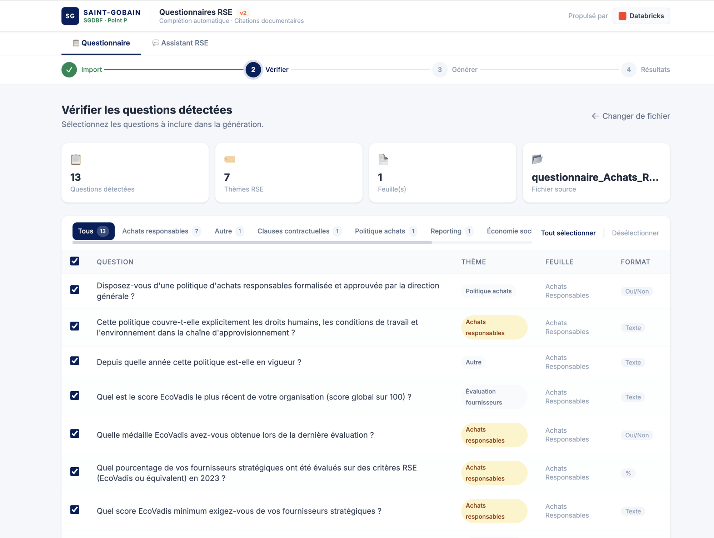
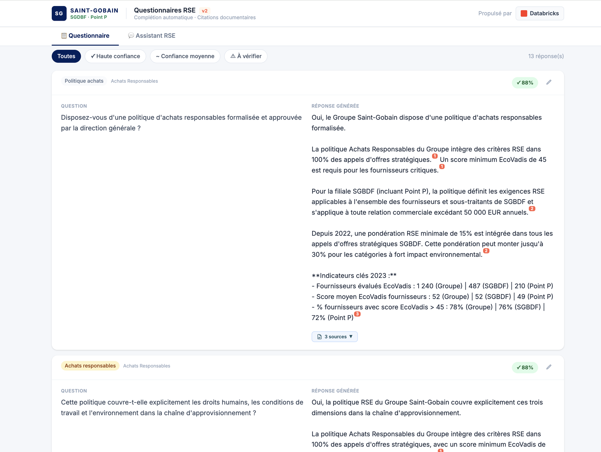
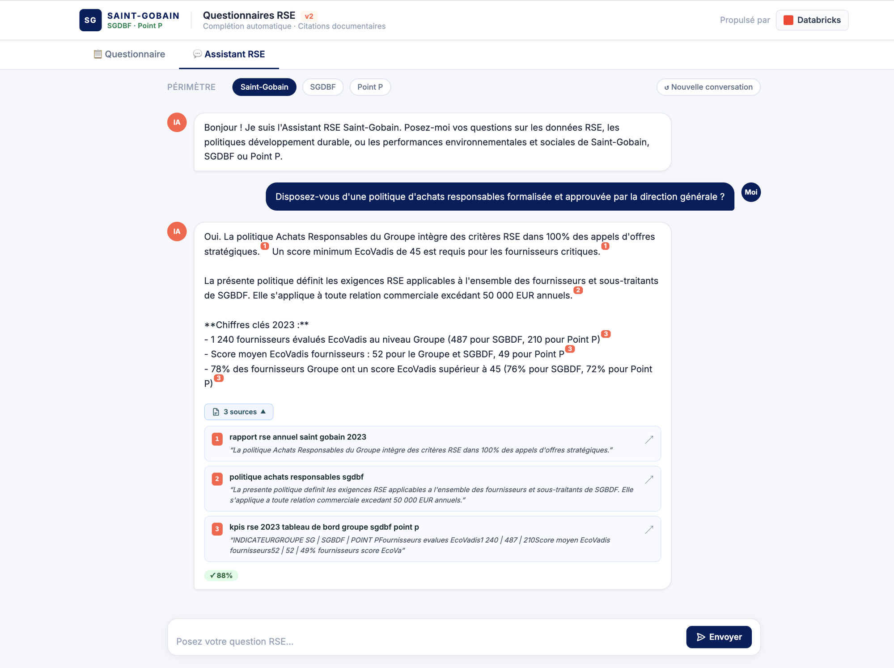

# RSE Questionnaire Filler — Saint-Gobain

**Automated CSR questionnaire completion powered by Databricks Agent Bricks (Knowledge Assistant) + FastAPI + Databricks Apps.**

Upload an empty RSE/CSR questionnaire (Excel or PDF), let AI answer every question from your company's knowledge base, review the results, and download the pre-filled file — in minutes instead of days.

---

## Screenshots

<table>
  <tr>
    <td align="center"><b>Step 2 — Question review</b></td>
    <td align="center"><b>Step 4 — Results with citations</b></td>
  </tr>
  <tr>
    <td></td>
    <td></td>
  </tr>
  <tr>
    <td align="center" colspan="2"><b>Chatbot tab — Answer with inline citations and source cards</b></td>
  </tr>
  <tr>
    <td colspan="2"></td>
  </tr>
</table>

---

## Table of Contents

1. [What it does](#what-it-does)
2. [Architecture](#architecture)
3. [Prerequisites](#prerequisites)
4. [Step-by-step deployment guide](#step-by-step-deployment-guide)
   - [1. Set up the Knowledge Assistant](#1-set-up-the-knowledge-assistant)
   - [2. Upload knowledge base documents](#2-upload-knowledge-base-documents)
   - [3. Deploy the app](#3-deploy-the-app)
   - [4. Grant permissions to the app service principal](#4-grant-permissions-to-the-app-service-principal)
5. [Configuration reference](#configuration-reference)
6. [Sample files](#sample-files)
7. [Using the app](#using-the-app)
8. [Chatbot tab](#chatbot-tab)
9. [Output Excel format](#output-excel-format)
10. [Troubleshooting](#troubleshooting)
11. [Project structure](#project-structure)

---

## What it does

| Step | Action |
|------|--------|
| **Upload** | User uploads an empty RSE questionnaire (.xlsx or .pdf) |
| **Parse** | App extracts questions, detects themes (CO2, Diversity, Governance…) and answer columns |
| **Answer** | For each question, calls a Databricks Knowledge Assistant endpoint over SSE |
| **Cite** | Each answer includes inline `[N]` citations linking to source PDF documents |
| **Review** | User reviews answers with confidence scores, edits if needed, opens cited PDFs inline |
| **Download** | Fills the original Excel file with answers + document references, downloads it |

A second **chatbot tab** provides a free-form RAG interface on the same knowledge base.

---

## Architecture

```
Browser
  │
  │  HTTPS
  ▼
┌─────────────────────────────────────┐
│         Databricks Apps             │
│   FastAPI + HTML/JS SPA             │
│   • File upload & question parsing  │
│   • SSE streaming progress          │
│   • Excel output generation         │
└──────────────┬──────────────────────┘
               │  REST (SDK)
               ▼
┌─────────────────────────────────────┐
│   Agent Bricks — Knowledge          │
│   Assistant serving endpoint        │
│   • RAG over RSE knowledge base     │
│   • Returns answers + url_citations │
└──────────────┬──────────────────────┘
               │
       ┌───────┴───────┐
       ▼               ▼
┌─────────────┐  ┌──────────────────┐
│   Vector    │  │  Unity Catalog   │
│   Search    │  │  Volume (PDFs)   │
│   Index     │  │                  │
└─────────────┘  └──────────────────┘
```

---

## Prerequisites

| Requirement | Details |
|-------------|---------|
| Databricks workspace | Serverless enabled (for Databricks Apps) |
| Unity Catalog | Enabled on the workspace |
| Databricks CLI | v0.200+ — [install guide](https://docs.databricks.com/dev-tools/cli/install.html) |
| Agent Bricks | Knowledge Assistant feature enabled |
| Python | 3.10+ (for local testing only — not needed for deployment) |

---

## Step-by-step deployment guide

### 1. Set up the Knowledge Assistant

The app relies on a **Databricks Agent Bricks — Knowledge Assistant** endpoint. This is a managed RAG service that indexes your PDF documents and answers natural language questions with citations.

#### 1a. Create a Unity Catalog volume for your documents

```sql
-- In a Databricks notebook or SQL editor
CREATE CATALOG IF NOT EXISTS rse_catalog;
CREATE SCHEMA IF NOT EXISTS rse_catalog.knowledge_base;
CREATE VOLUME IF NOT EXISTS rse_catalog.knowledge_base.documents;
```

#### 1b. Upload your RSE documents to the volume

Upload your PDF reports (annual RSE reports, EcoVadis documentation, policy documents, etc.) to the volume. You can do this via:

- **Databricks UI**: Catalog > Volumes > `rse_catalog.knowledge_base.documents` > Upload
- **Databricks CLI**:
  ```bash
  databricks fs cp my_report.pdf dbfs:/Volumes/rse_catalog/knowledge_base/documents/
  ```

#### 1c. Create the Knowledge Assistant

1. Go to **Machine Learning** > **Agent Bricks** in the Databricks sidebar
2. Click **Create Knowledge Assistant**
3. Configure:
   - **Name**: `rse-knowledge-assistant` (or any name — you'll reference it later)
   - **Volume path**: `/Volumes/rse_catalog/knowledge_base/documents`
   - **Embedding model**: `databricks-gte-large-en` (recommended)
4. Click **Create** and wait for indexing to complete (a few minutes per GB of documents)
5. Once created, note the **endpoint name** from the serving endpoint page (e.g. `ka-a2804329-endpoint`)

---

### 2. Upload knowledge base documents

If you already have a Vector Search index and a serving endpoint for your knowledge base, you can skip step 1 and go directly to step 3. Just update the `KA_ENDPOINT` constant in `app.py`.

---

### 3. Deploy the app

#### 3a. Clone this repository

```bash
git clone https://github.com/rodrimanu16/rse-filler-v2.git
cd rse-filler-v2
```

#### 3b. Edit `app.py` — set your endpoint name

Open `app.py` and update line 32:

```python
KA_ENDPOINT = "ka-a2804329-endpoint"   # ← replace with your KA endpoint name
```

The `WORKSPACE_HOST` is injected automatically by Databricks Apps via the `DATABRICKS_HOST` environment variable (configured in `app.yaml`). You don't need to change it.

#### 3c. Authenticate with the Databricks CLI

> **SSO users (no password):** Use the command below — it opens a **browser window** for your company SSO login. Do **not** run `databricks configure` (that asks for a Personal Access Token which you don't need).

```bash
databricks auth login --host https://<your-workspace>.cloud.databricks.com
```

A browser tab will open automatically. Log in with your SSO credentials (same as your Databricks workspace login). Once done, return to the terminal — it will confirm authentication.

Verify it worked:

```bash
databricks current-user me
# Should print your email address
```

> **Troubleshooting auth:** If the CLI still asks for username/password, your CLI version may be outdated. Update it:
> ```bash
> # macOS
> brew upgrade databricks
> # or re-download from https://docs.databricks.com/dev-tools/cli/install.html
> ```

#### 3d. Upload the source code to your workspace

```bash
# Replace <your-email> with your Databricks workspace user email (e.g. marie.dupont@company.com)
WORKSPACE_PATH="/Workspace/Users/<your-email>/rse-filler-v2"

databricks workspace mkdirs "$WORKSPACE_PATH/static"
databricks workspace mkdirs "$WORKSPACE_PATH/samples"
databricks workspace mkdirs "$WORKSPACE_PATH/docs"

# Upload all source files
databricks workspace import "$WORKSPACE_PATH/app.py"            --file app.py            --format AUTO --overwrite
databricks workspace import "$WORKSPACE_PATH/app.yaml"          --file app.yaml          --format AUTO --overwrite
databricks workspace import "$WORKSPACE_PATH/requirements.txt"  --file requirements.txt  --format AUTO --overwrite
databricks workspace import "$WORKSPACE_PATH/static/index.html" --file static/index.html --format AUTO --overwrite

# Upload sample questionnaires
for f in samples/*; do
  databricks workspace import "$WORKSPACE_PATH/$f" --file "$f" --format AUTO --overwrite
done
```

> **Alternative — no CLI upload needed:** You can also upload the files directly via the Databricks UI:
> 1. Open your workspace → **Workspace** (left sidebar) → navigate to `Users/<your-email>/`
> 2. Click **⋮ (kebab menu)** → **Create** → **Folder**, name it `rse-filler-v2`
> 3. Repeat to create sub-folders `static` and `samples` inside it
> 4. In each folder, click **⋮** → **Import** and upload the corresponding files from this repo

#### 3e. Create and deploy the Databricks App

```bash
# Create the app (only needed the first time)
databricks apps create rse-filler-v2 --description "RSE Questionnaire Filler — Saint-Gobain"

# Deploy
databricks apps deploy rse-filler-v2 \
  --source-code-path "$WORKSPACE_PATH"
```

The CLI will return the app URL, e.g.:
```
https://rse-filler-v2-<workspace-id>.aws.databricksapps.com
```

> **Alternative — deploy from the UI:** In the Databricks sidebar go to **Compute** → **Apps** → **Create App**. Give it a name, select **Custom app**, and set the source code path to the workspace folder you uploaded in step 3d.

---

### 4. Grant permissions to the app service principal

The app runs as a dedicated **service principal** (SP). It needs permission to:
- Call the Knowledge Assistant serving endpoint
- Read PDF files from the Unity Catalog volume (for the in-app PDF viewer)

#### 4a. Find your app's service principal ID

```bash
databricks apps get rse-filler-v2
```

Look for `service_principal_id` in the output (e.g. `9e45b146-8f1b-4f29-a2ea-8530a606cdc9`).

#### 4b. Grant Unity Catalog permissions

Run the following in a Databricks notebook:

```python
from databricks.sdk import WorkspaceClient
w = WorkspaceClient()

SP_ID = "9e45b146-8f1b-4f29-a2ea-8530a606cdc9"  # replace with your SP ID

# Grant access to the catalog
w.grants.update("catalog", "rse_catalog", changes=[{
    "principal": SP_ID,
    "add": ["USE_CATALOG"]
}])

# Grant access to the schema
w.grants.update("schema", "rse_catalog.knowledge_base", changes=[{
    "principal": SP_ID,
    "add": ["USE_SCHEMA"]
}])

# Grant access to the volume (needed for PDF viewer)
w.grants.update("volume", "rse_catalog.knowledge_base.documents", changes=[{
    "principal": SP_ID,
    "add": ["READ_VOLUME"]
}])
```

Or via SQL:

```sql
GRANT USE CATALOG ON CATALOG rse_catalog TO `<SP-application-id>`;
GRANT USE SCHEMA   ON SCHEMA  rse_catalog.knowledge_base TO `<SP-application-id>`;
GRANT READ VOLUME  ON VOLUME  rse_catalog.knowledge_base.documents TO `<SP-application-id>`;
```

#### 4c. Grant permission to call the serving endpoint

In the Databricks UI:
1. Go to **Serving** > find your KA endpoint (`ka-a2804329-endpoint`)
2. Click **Permissions**
3. Add the SP with **Can Query** permission

Or via the CLI:

```bash
databricks permissions update serving-endpoints <endpoint-id> \
  --json '{
    "access_control_list": [{
      "service_principal_name": "<SP-application-id>",
      "permission_level": "CAN_QUERY"
    }]
  }'
```

---

## Configuration reference

All configuration is in `app.py` (top of file):

| Variable | Default | Description |
|----------|---------|-------------|
| `KA_ENDPOINT` | `"ka-a2804329-endpoint"` | Name of your Knowledge Assistant serving endpoint |
| `WORKSPACE_HOST` | env `DATABRICKS_HOST` | Injected automatically by Databricks Apps |

The `app.yaml` file configures the runtime:

```yaml
command:
  - "python"
  - "-m"
  - "uvicorn"
  - "app:app"
  - "--host"
  - "0.0.0.0"
  - "--port"
  - "8000"

env:
  - name: DATABRICKS_HOST
    valueFrom: databricks-workspace  # automatically injected
```

---

## Sample files

The `samples/` directory contains four test questionnaires:

| File | Format | Description |
|------|--------|-------------|
| `questionnaire_EcoVadis_Carbone_2024.xlsx` | Excel | Carbon & energy questions (EcoVadis-style) |
| `questionnaire_Social_RH_2024.xlsx` | Excel | Social / HR questions (diversity, health & safety) |
| `questionnaire_Achats_Responsables.xlsx` | Excel | Responsible procurement questionnaire |
| `questionnaire_Biodiversite_2024.pdf` | PDF | Biodiversity & environment (PDF format) |

These files are loaded automatically in the app's **"Exemples"** section on the import screen — no manual upload needed.

> **Note**: The sample files contain example questions only. The AI answers will be drawn from whatever documents you have indexed in your Knowledge Assistant.

---

## Using the app

### Questionnaire tab

1. **Import** — Drag & drop your Excel or PDF questionnaire, or pick one from the sample list
2. **Vérifier** — Review detected questions, filter by RSE theme, deselect any you don't want answered
3. **Générer** — Select a scope (Saint-Gobain / SGDBF / Point P) and click Generate. Watch answers stream in live
4. **Résultats** — Review answers with confidence indicators:
   - 🟢 `≥ 80%` — high confidence (data found, numeric values cited)
   - 🟡 `55–79%` — medium confidence (qualitative answer)
   - 🔴 `< 55%` — to review (data not found in knowledge base)
5. Click any **source card** to open the cited PDF directly in the app with the referenced passage highlighted
6. Click **✏ Modifier** to edit any answer manually
7. Click **Télécharger** to download the filled Excel file

### Chatbot tab

Click **💬 Assistant RSE** in the top tab bar to access a free-form chat interface:

- Ask any RSE question in natural language
- Select the perimeter (Saint-Gobain / SGDBF / Point P) at the top
- Answers include the same inline citations and clickable source cards as the questionnaire tab
- Use **↺ Nouvelle conversation** to start fresh (new conversation context)

---

## Output Excel format

When the input is `.xlsx`, the app writes answers back into the **original file**, preserving all original formatting, and fills:

- The **answer column** (detected automatically from the header row) with the AI-generated response
- The **documents justificatifs column** (if present) with structured references: `[1] Rapport RSE 2023 · [2] Politique Diversité`

When the input is `.pdf` (or Excel without a detectable structure), a new formatted workbook is generated with columns:

| # | Question | Périmètre | Format | Réponse générée par IA | Documents justificatifs | Confiance | Validé ✓ |

---

## Troubleshooting

### App returns empty answers

**Cause**: The KA endpoint name is wrong, or the SP has no `CAN_QUERY` permission on the endpoint.

**Fix**: Visit `/api/debug-ka` (append to your app URL) — it shows SDK init status, current user, and a live test call with raw KA response.

### PDF viewer shows "Access denied"

**Cause**: The app SP has no `READ_VOLUME` permission on the Unity Catalog volume.

**Fix**: Run the `GRANT READ VOLUME` statement in step 4b.

### "Questions détectées: 0" after upload

**Cause**: The Excel file header row doesn't contain recognizable column names (e.g. "Question", "Libellé", "Réponse").

**Fix**: Make sure the header row contains at least one cell with a question-related keyword and one with an answer-related keyword. See `_Q_KW_RE` and `_A_KW_RE` in `app.py` for the full list of recognized keywords.

### App deployment fails with "source code path must be a valid workspace path"

**Cause**: The path passed to `databricks apps deploy` must be a **Databricks workspace** path (`/Workspace/...`), not a local filesystem path.

**Fix**: Upload your local files first (step 3d), then deploy from the workspace path.

### Endpoint not found (404 on KA call)

**Cause**: The serving endpoint is stopped or the name is misspelled.

**Fix**: Check the endpoint status in **Serving** in the Databricks UI, ensure it's in `Ready` state, and verify `KA_ENDPOINT` in `app.py` exactly matches the endpoint name (case-sensitive).

---

## Project structure

```
rse-filler-v2/
├── app.py                   # FastAPI backend (file parsing, KA calls, Excel output)
├── app.yaml                 # Databricks Apps runtime config
├── requirements.txt         # Python dependencies
├── static/
│   └── index.html           # Single-page frontend (Tailwind CSS + vanilla JS)
├── samples/
│   ├── questionnaire_EcoVadis_Carbone_2024.xlsx
│   ├── questionnaire_Social_RH_2024.xlsx
│   ├── questionnaire_Achats_Responsables.xlsx
│   └── questionnaire_Biodiversite_2024.pdf
└── docs/
    ├── architecture_rse_filler.pdf
    └── architecture_rse_filler.svg
```

---

## Tech stack

| Layer | Technology |
|-------|-----------|
| Runtime | [Databricks Apps](https://docs.databricks.com/en/dev-tools/databricks-apps/index.html) |
| Backend | [FastAPI](https://fastapi.tiangolo.com/) + [Uvicorn](https://www.uvicorn.org/) |
| AI / RAG | [Databricks Agent Bricks — Knowledge Assistant](https://docs.databricks.com/en/generative-ai/agent-bricks/index.html) |
| Data | [Unity Catalog](https://docs.databricks.com/en/data-governance/unity-catalog/index.html) Volumes + Vector Search |
| Frontend | Vanilla JS + [Tailwind CSS](https://tailwindcss.com/) (CDN) |
| Excel | [openpyxl](https://openpyxl.readthedocs.io/) |
| PDF parsing | [pdfplumber](https://github.com/jsvine/pdfplumber) |
| Auth | Databricks SDK OAuth M2M (automatic via Databricks Apps) |

---

## License

MIT — feel free to adapt this for your own RSE questionnaire workflows.
